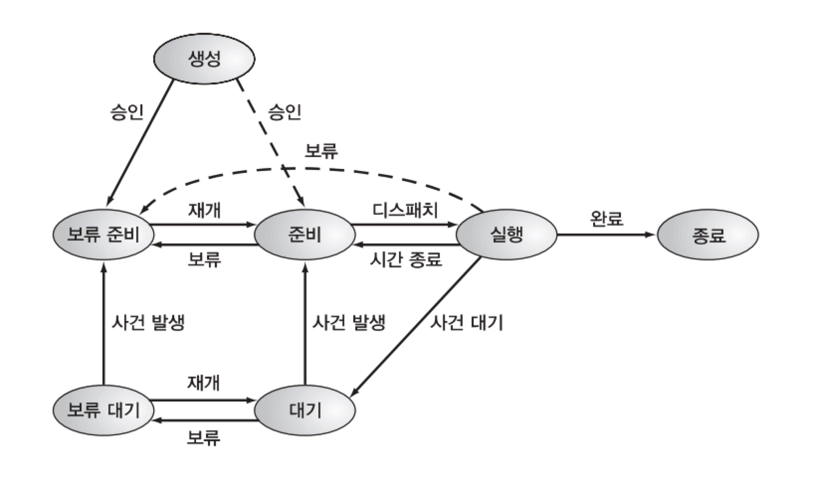

## Operation System

한번에 한개씩 처리하게될 경우 CPU 가 놀게됨(예 IO 처리할 동안)
조건: 어떠한 작업도 실행되기 위해 메인 메모리에 있어야함

결론: 여러 개의 작업들이 메인메모리에 있으면됨
이게 다중프로그래밍이고 이를 위해 멀티 프로세싱이 불가피해지는거겠지(병렬처리)


컴퓨터책상(메인메모리)에 컴퓨터(커널)를 올려놓고 사용하자
읽을 책(다른 프로그램)은 책장(다른 저장장치)에 잘 보관하고있다가 필요해지면 책상에 올려서 공부하자

## Interrupt

**폴링 vs 인터럽트** 
polling: CPU가 일정한 시간 간격을 두고 각 자원들의 상태를 주기적으로 확인
  - 폴링의 간격을 적절히 정해야 하는 문제
  - 각 자원들은 직전 폴링 이후 변화된 자신의 상태를 다음번 폴링 때까지는 알릴 수 없음
  - CPU 는 아무 일이 없었는데도 폴링에 일정량의 시간을 들여야 하는 리소스 낭비
interrupt: 각 자원들이 능동적으로 자신의 상태변화를 CPU에 알리는 방식
  - CPU는 따로 시간을 들이지 않아도 된다
  - 자원들은 상황이 발생하면 즉시 알려 처리를 받을 수 있음

**인터럽트 처리 과정**
1. 장치가 인터럽트 신호를 CPU에게 보냄
2. CPU가 명령어를 실행 중이었다면 먼저 해당 명령어를 실행 완료
3. 인터럽트 신호 확인
4. 현재 실행 중이던 프로그램이 인터럽트 처리 후 다시 실행될 때를 위해 현 상태 정보(PSW, PC 레지스터 정보)를 시스템 스택에 저장
5. 인터럽트 처리 루틴의 시작 주소를 PC에 넣어 인터럽트 처리 루틴을 실행
6. 인터럽트의 처리가 끝나면 이전에 저장하였던 레지스터 값들을 다시 재저장한 후 PSW, PC 값들을 원래 자리에 다시 넣어주고, 실행


## Input/Output
각각의 입출력 장치에는 컨트롤러가 있고 여기에는 CPU 와 입출력할 데이터를 저장할 수 있는 버퍼가 존재한다 

- programmed I/O
- interrupt driven I/O
- Direct Memory Access(DMA)
- Isolated I/O
- Memory-mapped I/O


## Process, Thread

**Process control block**
- 프로세스의 모든 정보를 표현하는 테이블 모양의 자료구조
- PCB의 작업은 매우 빈번하게 일어나므로, PCB는 기본적으로 메모리에 저장 


**프로세스의 상태**

- new
- ready
- Running: CPU 를 할당(dispatch)받아 실행중인 상태실행 상태 
- Blocked: 프로세스가 실행되다가 입출력 처리를 요청하거나 바로 확보 될 수 없는 자원을 요청했을 때의 상태
- Exit
- Suspend: 프로세스가 메모리 공간을 뺏기고 디스크로 나감(swapping) 
- Ready Suspend 
- Blocked Suspend


**Thread**
스레드를 만들고, 없애며, 이들 간의 스위칭에 소요되는 시간과 비용이 프로세스 단위보다 빠르고 저렴
- 프로세스 간의 통신은 커널의 개입을 필요로 하지만
- 한 프로세스 내의 스레드 간의 통신은 메모리와 파일을 공유하기 때문에 커널의 개입이 필요 없다
- CPU의 할당 단위가 스레드 이므로, CPU 스위칭을 위한 쓰레드 단위의 자료는 유지되어야 한다
- 여전히 프로세스 단위로 행해지는 보류, 종료 등은 해당 프로세스에 속하는 전체 스레드에 동일한 영향을 미친다


**스레드의 상태와 동기화**
- 실행, 준비, 대기 상태를 가짐
- 대기는 레지스터 값, 프로그램 카운터, 스택 포인터 등을 보관
- 스레드의 종료는 해당 스레드의 레지스터 값들과 스택을 초기화합니다
- 한 프로세스 내의 스레드들이 주소 공간과 자원을 공유한다
  - 는특정 스레드의 변경이 타 스레드에도 영향이 있기때문에 동기화가 필요


**스레드의 종류**
- 사용자 레벨 스레드
  - 스레드 스위칭에 커널의 개입이 필요 없으므로, 모드 스위칭이 필요 없음
  - OS에 독립적으로 스케쥴링을 사용할 수 있으므로, 어떤 운영체제에서도 운영 가능
  - 특정 스레드의 blocked -> 프로세스 내의 스레드 block
  - CPU가 프로세스 단위로 할당 되기 때문에 다중처리의 환경이 주어진다 하더라도 스레드 단위의 다중처리가 되지 못함
- 커널 레벨 스레드
  - 스케줄링은 커널에 의해 스레드 단위로 이루어지므로 유저 레벨 스레드의 단점을 극복
  - 다중 처리의 환경일 경우 한 프로세스 내의 다수 스레드는 각각 처리기를 할당 받아 병렬로 실행이 가능
  - 한 스레드의 대기 시 같은 프로세스에 속한 다른 스레드로 스위칭이 가능
  - 같은 프로세스에 속한 스레드 간의 스위칭에도 커널의 개입이 필요하므로 모드 스위칭이 필요
  
  
## CPU Scheduling
목적: CPU 를 할당받을 프로세스를 잘 골라 실행하여 전체적인 성능을 높여라


**성능이 좋다**
- Response Time & Throughput trade-off
- Response time 을 줄이기위해 스케줄링을 자주한다 -> frequent context switching -> low throughput
- throughput 을 높이기위해 수행 시간이 짧은 프로세스를 주로 처리 -> 수행 시간이 긴 프로세스 처리가 늦어짐   


**언제 가동?**
1. running -> blocked: 입출력 요청
2. running -> ready: time-out, interrupt
3. blocked -> ready: 입출력 종료
4. exit


**분류**
- Preemptive: 우선순위에 따라 CPU 를 선점(2, 3)
- Non-preemptive(1, 4)


**Scheduling Algorithms**
- First Come First Service(FCFS, FIFO)
- Shortest Process Next(SPN)
- Shortest Remaining Time(SRT)
- Highest response Ration Next(HRRN)
- Round-Robin
- Multi-level Queue
- Multi-level Feedback Queue(MFQ)
- Fair-share

**Realtime Scheduling**
- Rate Monotonic
- Earliest Deadline First
 

### Flow
1. 대기 중인 여러 프로세스는 어떤 기준으로 CPU 를 할당받을까?
2. 언제 스케줄링을 해야할까?
3. 어떤 기법들이 있을까?


## Concurrent Process & Synchronization

**Race Condition**
- Mutual Exclusion
- Deadlock
- Starvation


**Mutual Exclusion**
- Critical Resource: 동시에 사용할 수 없는 자원
- Critical Section: Critical Resource 에 접근하는 프로그램 코드부분
  - 한 번에 하나의 프로세스만
1. 다른 프로세스가 있는지 확인
2. 없다면 들어가면서 다른 프로세스가 들어오지 못하도록
3. 벗어날 때는 자신이 나오는 사실을 알린다

**프로그램 레벨의 Mutual Exclusion**
```
/* Perterson */
void P0( )
{
  While (true)
  {
    flag[0] = true;
    turn = 1;
    While (flag[1] && turn == 1); /* do nothing */
    <critical section>;
    flag[0] = false;
    <remainder >;
  }
}
```     

```
/* Lamport's bakery
do {
  choosing[i] = true;
  number[i] = max(number[0], number[1],...,number[n - 1])+1;
  choosing[i] = false;
  for (j = 0; j < n; j++) {
    while (choosing[j]) ;
    while ((number[j]!= 0) && ((number[j],j) < (number[i],i)));
  }
  <critical section>;
  number[i] = 0;
  <remainder >;
} while (1);
```

이런 종류들의 알고리즘은 중복 진입을 막기위해 while 문을 계속 맴돌아서(Spinlock) CPU 의 낭비를 초래함
또한 프로그래머의 실수로 인한 오류도 생길 수 있음


**하드웨어 레벨의 Mutual Exclusion**
- interrupt 금지: critical section 실행 완료할 때까지 인터럽트 금지
  - 모든 종류의 인터럽트 금지는 비효율적 시스템 운영
  - 처리기 단위이므로 다중처리 시스템에서 다른 처리기에서 실행되는 프로세스의 접근은 여전히 가능
- 하드웨어는 기본적으로 특정 메모리 주소에 대한 접근을 한 번에 하나의 요청으로 제한
```
/* 실제로는 기계명령어로서 원자적으로 실행됨 */
boolean testandset(boolean &target) {
  boolean rv = target;
  target = true;
  return rv;
}

/* swap */
void exchange (boolean &r, boolean &m) {
  boolean temp = r;
  r = m;
  m = temp;
}

/* testandset() 을 이용 */
const int n=...; // 프로세스 개수
boolean lock;

void P(int i) {
  while (true) {
    while (testandset(lock));
    <critical section>;
    lock:=false;
    <remainder>;
  }
}

void main() {
  lock:=false;
  parbegin
  P(1), P(2),...,P(n);
  parend;
}

/* exchange() 이용 */
const int n=...; // 프로세스 개수
boolean lock;

void P(int i) {
  while (true) {
    while (testandset(lock));
   <critical section>;
   lock:=false;
   <remainder>;
  }
}
void main() {
  lock:=false;
  parbegin
  P(1), P(2),...,P(n);
  parend;
}
```

기계명령어를 활용하면 간단하고, 다중처리 시스템에서도 쉽게 쓸 수 있지만,
여전히 바쁜 대기를 한다는 점과, Starvation, Deadlock 에 빠질 수 있다는 단점


**Semaphore**
프로그래밍 언어, 운영 체제 수준에서 동시성을 제공함
- P 명령(wait, down)
```
P(S): if (S > 0) then S = S - 1;
      else S > 0 조건이 만족될 때까지 큐에서 대기;
```
- V 명령(signal, up)
```
V(S): if (큐에서 대기중인 프로세스들이 존재) 
       then 그 중의 한 프로세스를 준비 또는 실행 상태로 만듦;
      else S = S + 1;
```

```
const int n
semaphore s = 1;
void p(int i) {
  while (true) {
    P(s);
    <critical section>;
    V(s);
    <remainder>;
  }
}
void main() {
  parbegin
  p(1), p(2),...,p(n);
  parend
}
```

**Concurrent Process & Synchronization 과 관련된 여러 문제들**
- producer-consumer
- Reader-writer
- Dinning Philosopher
- Cigarette Smoker
- Barber Shop


## Deadlock

**원인**
1. Mutual Exclusion Condition: 여러 프로세스들이 동시에 사용할 수 없는 자원
2. Partial Allocation: 필요한 일부분씩 확보, 실행
3. No Preemption
4. Circular-Wait


**해결**
- Prevention: 아예 발생하지 않도록
- Avoidance: 교착 상태를 피하는
- Detection & Recovery: 발생되도록 놓아두었다가 발생 시 탐지하여 조치


**Prevention**
4가지의 원인 중 하나를 없애자
- Mutual Exclusion Condition: 배타적으로 사용할 수 밖에없는 자원은 불가능 
- Partial Allocation: 필요한 모든 자원을 미리 할당
  - 모든 자원을 미리 할당할 때까지 자원이 낭비됨
- No Preemption: 선점 불가능한 자원을 가능하게 만든다
  - 비정상적인 종료로 많은 문제들의 원인이 됨
- Circular-Wait: 자원의 순서를 정하자
  - 순서를 지켜야 하기 때문에 필요 없는 자원을 먼저 할당받아야 함
  - 결국에는 자원 낭비

**Avoidance(Banker's Algorithm)**
- Safe State: Deadlock 이 발생할 수 없는상태
- 은행가 알고리즘의 조건
  - 시스템 내의 프로세스 수 고정
  - 자원의 수 고정
  - 각 프로세스가 요구할 자원의 최대 개수가 알려져야 함
  - 프로세스는 할당받은 자원을 사용 후 반드시 반납
  - 이런 가정들이 현실적으로 불가능하기 때문에 현실적으로는 불가능
- 은행가 알고리즘
  - Safe/unSafe 를 판단하여 safe state 를 유지함   


**Detection & Recovery**
- Resource Allocation Graph(RAG)
  - Directed Bipartite Graph(방향성 이분 그래프): Node 와 Edge 들로 이루어짐
  - Node: 프로세스와 자원들을 표현
  - Edge: 자원들 간의 할당과 대기 상황을 나타냄 
  - 어떤 프로세스가 어떤 자원을 가지고 있는가
  - 어떤 자원에 의해 대기 상태가 되었는가
- Recovery
  - Deadlock 에 걸려있는 프로세스(1개이상)를 강제종료
    - 어떤 프로세스를 종료?(Termination Cost)
    - Termination Cost: Priority, 종류, 실행된 시간, 남은 시간 등
    - 모든 부분집합에 대해 비용을 계산하기 복잡하고 교착상태가 제거되었는지 확인해야 함
  - 자원을 가져와 할당해 줌
    - 필요한 자원을 가지고 있는 프로세스로부터 강제로 뺏어(선점하여) 해결
    - 결국 강제종료로 인한 문제들(자원낭비)이 야기됨
    - Checkpointing & restart: checkpoint 를 만들고 해당 checkpoint 에서 restart


### Flow
1. Deadlock 이 무엇이고 어떤 상황에서 발생하는가?
2. 원인은 무엇?
3. 어떻게 해결?(예방, 회피, 탐지 장/단점)
